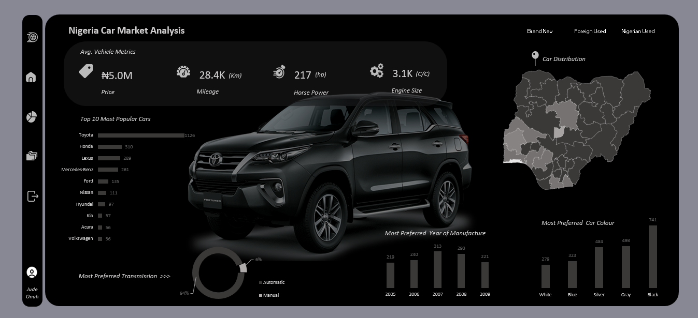

# Nigeria Car Market Analysis
___

## Project Overview

This project analyzes the Nigeria car market using Microsoft Excel and Power Query to uncover pricing patterns, popular brands, color preferences, transmission trends, and geographic demand concentration.

The objective is to provide data-driven insights that support sales strategy, inventory planning, and market expansion decisions for an automotive sales company.
___

  

___

## Table of Content
* [Tools and Technologies](#tools-and-technologies)
* [Dataset Description](#dataset-description)
* [Data Cleaning and Preprocessing](#data-cleaning-and-preprocessing)
* [Key Findings and Insights](#key-findings-and-insights)
* [Conclusion](#conclusion)

## Tools and Technologies

* Microsoft Excel
* Power Query (ETL & Data Cleaning)
* Pivot Tables & Aggregations
* Descriptive Statistics
___

## Dataset Description
The dataset consists of 2,873 car listings in the Nigerian auto market with main attributes such as:
* Car ID
* Car Brand
* Price (Amount)
* Color
* Transmission Type
* State (Location)
___

## Data Cleaning and Preprocessing

All data preprocessing was done using Power Query to ensure accuracy and consistency before analysis. Cleaning Steps Performed:
* Removed 0 Duplicates
* Records with unpopular Nigeria transmission type were filtered out.
* Converted price (amount) to numeric.
* Ensured categorical fields (brand, color, state, transmission) were text.
* Applied meaningful, analysis-friendly column names.
* Standardized State names
* Trimmed & Cleaned Text
___

## Key Findings and Insights
### 1. Average Car Price
₦4,986,147 (approx. ₦5M)

Indicates a mid-range dominated market rather than luxury-focused.

### 2. Overall Most Popular Car Brands

The Nigerian car market is driven by affordable, reliable brands like:
* Toyota (1,126)
* Honda (310)
* Lexus (289)

**Insight:** Buyers prioritize durability and maintenance affordability over luxury branding.

### 3. Overall Most Preferred Car Colors
* Black (741)
* Grey (498)
* Silver (484)	

**Insight:** Neutral and low-maintenance colors dominate consumer preference.

### 4. Top States by Car Listings
* Lagos (1452)
* Federal Capital Territory	(654)
* Oyo (270)

**Insight:** Car demand is high in Lagos, the FCT, and Oyo, indicating strong regional market opportunities.

### 5. Transmission Preference
* Automatic	= 2,702 (94%)
* Manual = 171 (6%)

**Insight:** Automatic transmission is overwhelmingly preferred in Nigeria, probably driven by traffic conditions and driving convenience.

### 6. Most Preferred Year of Manufacture
* Cars manufactered in 2007 were most preferred (313 listings), closely followed by 2008 (293).
* There is a clear concentration of demand for vehicles manufactured between 2006 and 2008, indicating this range represents the sweet spot for buyers.
* Interest drops for vehicles older than 2005 and newer than 2009 within this dataset, suggesting buyers are optimizing for affordability, mechanical reliability, and availability of spare parts rather than vehicle age alone.

___

## Conclusion

This analyis shows the market favours automatic, mid-priced vehicles. Regional demand outside major hubs is significant and should be considered. We also see that colour choice impacts resale speed. Finally, Nigerians tend to favour affordability over luxury as we see affordable brands dominate listings.

